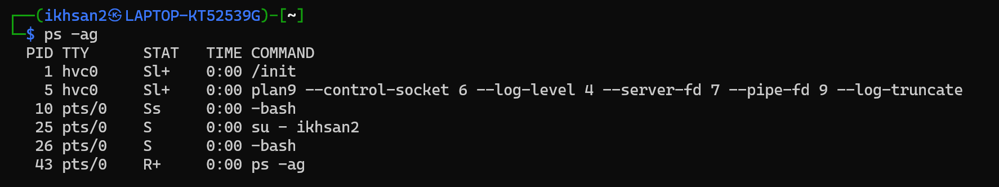
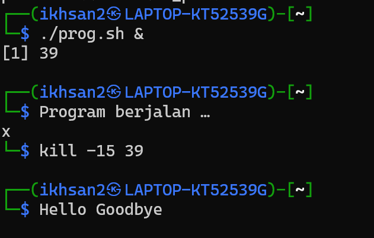
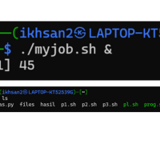

# Tugas-SO-Manajemen-Proses

# Praktikum 6 - Linux Shell

Repositori ini berisi jawaban dari Praktikum 6 Linux Shell, khususnya bagian BAB E.

---

## Soal 1: Proses dan Hierarki

### A. Nama-nama proses yang bukan root
Gunakan perintah berikut:
```bash
ps -eo user,comm | grep -v '^root'
```
Ini akan menampilkan semua proses yang **tidak dijalankan oleh user root**.

### Terminal & Coding:
- `bash`, `zsh` — shell
- `Vim`, `nano`, `code` — text editor
- `python`, `perl`, `ruby`, `node` — scripting
- `gcc`, `g++`, `make` — compiler/build tool

### Network Tools (user-level):
- `nmap` (untuk scan biasa, bukan yang butuh root)
- `whois`, `dig`, `nslookup` — DNS info
- `curl`, `wget` — download data
- `tcpdump` (bisa dijalankan tapi terbatas tanpa root)

### Tools Pentest Bisa Tanpa Root (beberapa mode):
- `sqlmap` — untuk tes SQL injection
- `hydra` — brute force tool
- `dirb`, `gobuster` — directory brute force
- `msfconsole` — Metasploit Framework (bisa jalan tanpa root, tapi banyak exploit perlu root)
- `nikto` — web server scanner
- `setoolkit` — Social Engineering Toolkit (jalan, tapi fitur tertentu butuh root)

### GUI Tools:
- `firefox`, `burpsuite`, `wireshark` (jalan tapi terbatas), `gedit`

### B. PID dan COMMAND dari proses yang paling banyak menggunakan CPU Time
Gunakan perintah berikut:
```bash
ps -eo pid,comm,etime,%cpu --sort=-%cpu | head -n 2
```
Baris kedua (setelah header) adalah proses dengan penggunaan CPU terbesar.

### Screenshot:


### C. Buyut Proses dan PID
Misalnya kamu menemukan PID 1234, jalankan perintah berikut untuk melacak sampai buyut:
```bash
ps -o ppid= -p 1234        # dapatkan parent
ps -o ppid= -p [parent1]   # dapatkan grandparent
ps -o ppid= -p [parent2]   # dapatkan buyut
```
Lalu ambil nama proses buyut dengan:
```bash
ps -p [buyutPID] -o pid,comm
```

### D. Contoh Proses Daemon
Beberapa contoh proses daemon:

### Sistem & Service
- `systemd` — init system & manajer layanan utama
- `cron` — scheduler untuk tugas otomatis (cron jobs)
- `rsyslogd` — logging system
- `dbus-daemon` — komunikasi antar proses
- `udisksd` — manajemen disk/partisi
- `polkitd` — policy kit untuk hak akses

### Jaringan
- `NetworkManager atau networkd` — manajemen jaringan
- `sshd` — OpenSSH server
- `avahi-daemon` — layanan pengenalan jaringan (bonjour/zeroconf)
- `dhclient` atau `dhcpcd` — klien DHCP untuk IP dinamis
- `wpa_supplicant` — otentikasi Wi-Fi

### Keamanan
- `fail2ban-server` — mencegah brute force login
- `clamd` — daemon antivirus ClamAV

### Penyimpanan
- `udisksd` — disk management
- `smartd` — monitoring kesehatan hard drive (SMART)
- `systemd-udevd` — mengatur perangkat hardware yang terhubung

### Lain-lain
- `cupsd` — layanan printer
- `bluetoothd` — layanan Bluetooth
- `colord` — layanan pengelolaan warna (kalibrasi monitor)
- `pulseaudio` atau `pipewire` — layanan audio

### E. Rantai Proses ke PPID = 1
Langkah di terminal:
```bash
$ csh     # masuk ke shell C
$ who     # lihat user login
$ bash    # buka shell bash dari dalam csh
$ ls      # lihat isi direktori (opsional)
$ sh      # masuk ke shell sh dari dalam bash
$ ps      # tampilkan proses aktif
```
Ambil PID terbesar dan telusuri prosesnya ke atas menggunakan `ps -o ppid=` sampai PPID = 1. Ini menunjukkan urutan hierarki proses dari shell ke induk sistem.

---

### Screenshot :


---

## Analisis:
PID terbesar: 55 (proses sh)
### Lacak urutan proses:
- `ps` (PID 55) dijalankan dari → `sh` (PPID 54)
- `sh` (PID 54) dijalankan dari → `bash` (PPID 50)
- `bash` (PID 50) dijalankan dari → `bash` (PPID 44)
- `bash` (PID 44) dijalankan dari → `bash` (PPID 26)
- `bash` (PID 26) dijalankan dari → `systemd/init` (PPID 1)

## Soal 2: Menjalankan dan Memberhentikan Proses Background

### Script: `prog.sh`
```bash
#!/bin/sh
trap "echo Hello Goodbye" SIGTERM

echo "Program berjalan …"
while :
do
    sleep 1
done
```

### Langkah:
1. Jalankan program:
```bash
./prog.sh &
```
2. Catat PID yang muncul.
3. Hentikan proses:
```bash
kill -15 [PID]
```

### Screenshot:


---

## Soal 3: Menjalankan Script dengan Trap untuk Menghapus File

### Script: `myjob.sh`
```bash
#!/bin/sh
trap "rm -f berkas hasil; echo 'File dihapus karena proses dihentikan.'" SIGINT SIGTERM

i=1
while :
do
    find / -print > berkas 2>/dev/null
    sort berkas -o hasil
    echo "Proses selesai pada $(date)" >> proses.log
    sleep 60
done
```

### Screenshot:


---

